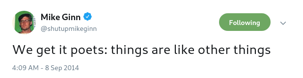

# Education for technical subjects

This repository is a standard for creating a Quality Insured And Great EducationTM. It includes everything from how to structure your lessons to actual practical tools to simplify and effectively create content for your students. This is **not a best practice or a silver bullet**, it's just based on first hand experience and may well be very wrong on some parts and I do not always follow these guidelines myself because I am mortal.

## Continuity

Everything can be reused and further built upon. Resuse everything you can and try to build on existing code. An example of how I structure one of my courses in HTML/CSS/JS, the days/number of days doesn't matter, it's more about the order. By always reusing previous code we can quicker get up to speed with the goal of the day instead of reinventing the wheel all the time.

* Day 1: _"Today we will recreate a common web-component in HTML structure_:
```html
<div>
    <p>The Avengers: Infinity War</p>
    <p><strong>Rating: 8.9</strong></p>
    <p><em>Genres: Action, Comedy</em></p>
</div>
```
* Day 2: _"Today we will style this element as a standard card-component"_: `<div class="card"></div>`
* Day 3: _"Today we will place this card in a `flexbox`-grid/`float`-grid"_
* Day 4: _"Today we will use a single column layout on small screen and expand the cards to a multi-column grid on bigger screens"_
* Day 5~8: _"Today we will learn about control statements and loops in JavaScript so we can programmatically create this card multiple times in the DOM"_
* Day 9: _"Today we will replace the hardcoded values in the card with this array of objects that represent some data from a database"_
* Day 10: _"Today we will fetch data from IMDBs API and replace our previous array of objects with actual up to date data"_
* Day 11: _"Today we will save our favorite movies in the browser by using buttons and events"_
* Day far ahead in the future: _"Today we will fetch movies from an API and save our favorites both in the browser and our own database and connect it to our logged in user"_

## Structure

### Day to day
> A single day in higher education is usually **6 hours**. Depending on the subject the steps below can be repeated 2-4 times a day (excluding step 1). This means that you can have one or two big presentations followed by exercises and feedback or you could have many short presentations and shorter exercises. The exercises should be in focus.

1. **Clarify the content of the day**: what we will learn and why is it important to learn based on **practical day to day usage**. Don't start of by explaining the theoretical parts of `Big O Notation`, start of by saying: _"Every loop or sort impacts performance making your application slower which makes your users impatient which results in loss of customers and money. Big O helps you understand that impact."_
    * _"We will learn the basics of how a function works, well defined functions helps you debug, scale functionality and find problems faster."_
2. **Supershort slides about the subject**: The basics can be read in the documentation of the tool/language or _any_ tutorial on the internet so keep that part really short. Your slides should be about _gotchas_, _best practices_, _pitfalls_ and _the why_. Some of these things can be brought up at the end of the day instead when the students have some experience with the problems. **More teorethical parts can be left as _Further reading_-links in the course material.**
3. **CODE DEMO: Jump into code as quick as possible**. Comments in code can be used as _"slides"_. Show at least two areas of application, preferably real world usage. `class Cat extends Animal` is fine if your real world classes are too complex but "regular examples" usually makes the code too abstract. It is always a good idea to step through code with a debugger if possible.
4. **EXERCISES**: most important part, a lot of exercises with varying level of difficulty. Spend more time on the exercises than the time spent on presentations.
5. **Solutions/feedback**: **Ask if some students want to show their solutions. It doesn't have to be finished solutions. You can use a students code and solve it live with the help of the class. As long as some key concepts and gotchas are brought up. Create an environment were showing your code is encouraged**. If no volunteers, walk through some solutions yourself to some of the exercises that you found that the students had the hardest time to grasp. Use a debugger to step through the code here.
6. Move on to next deeper area of subject or a different subject. Repeat step 2-5 until end of day. At end of day, summarize the content of the day.

## Explanations

* **Always have two explanations**: one correct but technical and one semi-correct that is primary non-technical.



* **Analogy**
    * _"An analogy is a cognitive process of transferring information or meaning from a particular subject (the analog, or source) to another (the target), or a linguistic expression corresponding to such a process."_ - Wikipedia
    * _"I know what an analogy is. It's like a thought with another thought's hat on."_ - Britta Perry, Community S03E11

## Tools

### Presentation

* [Deckset](https://www.deckset.com/)
    - Only for _Mac_. Turns `.md`-files into presentations. Easier to change, write and commit. Can be exported as `.pdf` for example.
* [Reveal.js](https://revealjs.com/#/)
    - HTML-based presentation tool. Can be made to handle `.md`-files as well.
* [MDX-Deck](https://jxnblk.com/mdx-deck/#0)
    - React-based presentation tool that uses `.md`-files for content.
* [Slides.com](https://slides.com/)
    - HTML-based presentation tool, online tool based on reveal.js
* [hackmd](https://hackmd.io/)
    - Collaborative markdown-notes with built in presentation mode

### Course material


